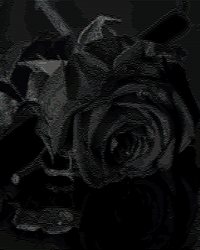

# asciify
## ASCII Art generator using Python

A very simple algorithm which turns RGB images into ASCII Art. It features higlights/shadows adjustments as well as live video preview
 

  
  

## How it works?
Firstly, the script converts the given image to grayscale while resizing it. 
Then, for each pixel, it prints a character which corresponds to its luminance.
You can define custom sets of characters as well as threshold functions, which map the pixel values to the symbols.

## Threshold functions
__A TLDR for those who are familiar with Tone Curves in photo post-processing: it works in a very simmilar way.__

  

These functions map a symbol to an interval of greyscale values.
Let's place the symbols within regular steps on the X-axis. The set of pixel values corresponding to the symbol _i_ is
_f_(k/255 * (_i_-1)) < x <= _f_(k/255 * i), where

- k - amount of symbols used
- _i_ - sequence number of the given symbol
- f(x) - the threshold function

The list of symbols must be in order from darkest to brightest.

The graph above shows three functions:
- y=x (blue), which is a default linear map
- y=(-50000)/(x+130) + 384 (black), which results in high contrast
- y=(-100000)/(x/2+165) + 600, which gives a low contrast

Notice, that what the black function does, is that
it makes the intervals longer for low values and shorter for higher ones. This means, that shades in higher detail can be seen for bright spots,
and the darker ones are primarly black. All in all this makes some images more clear.

Some basic functions are defined under 
`from asciify import IAcurves`

## Custom parameters

You can define custom parameters by using the following commands:
* Threshold function
use define_tone_curve() and a lambda:
`IA.define_tone_curve(lambda x: 6.4*x**(2/3))`
or use a predefined model:
`IA.define_tone_curve(IACurves.linear(1.05, -12))  # gives y=1.05x+12`
* Symbol set
use _symbols_ parameter on initialization:
`IA = ImageAsciifier(symbols=['.', 'o', 'O', '#']`
* Custom map
use _charmap_ parameter on initialization:
`IA = ImageAsciifier(charmap={127: ' ', 255: "H"})`
for binary output.

